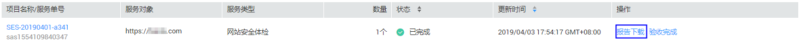

# 下载安全专家服务报告

## 操作场景

安全专家服务完成后，系统自动生成安全专家服务报告，并将报告保留15天，用户可以在此期间下载并查看安全专家服务报告。如果超出该时间范围，用户需要获取安全专家服务报告，请联系客服处理。

## 前提条件

-   已获取管理控制台的登录账号与密码。
-   安全专家服务完成，且服务单的状态为“已完成“。

## 操作步骤

1.  登录管理控制台。
2.  单击页面上方的“服务列表“，选择“安全  \>  安全专家服务  \>  服务列表“，进入安全专家服务列表界面。
3.  在需要下载安全专家服务报告的服务单所在行，单击“报告下载“，如[图1](#fig20623143618112)所示，下载并查看安全专家服务报告。

    **图 1**  下载报告  
    

    > **注意：**   
    >测评报告下载暂时仅支持安全专家服务的标准版和企业版报告下载，等保安全测评报告将由测评机构直接邮寄给用户。  

