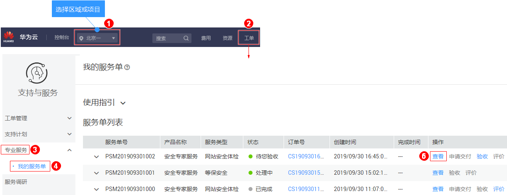

# 下载安全专家服务报告

## 操作场景

安全专家服务完成后，系统自动生成安全专家服务报告，用户会收到邮件和短信通知信息。用户可在收到通知信息后下载安全专家服务报告。

## 前提条件

安全专家服务完成，且服务单的状态为“待您验收“或“已完成“。

## 操作步骤

1.  [登录管理控制台](https://console.huaweicloud.com/?locale=zh-cn)。
2.  进入下载安全专家服务报告入口，如[图1](#zh-cn_topic_0120428366_fig17532142516127)所示。

    **图 1**  进入下载安全专家服务报告入口  
    

3.  在“服务单完成信息“区域，单击“下载“获取详细的安全专家服务的服务报告。

    同时也可在“处理日志“区域，单击“下载“查看服务单的过程交付件和安全专家服务报告。

    > **说明：**   
    >等保安全仅支持下载整改解决方案和差距分析报告，测评报告请查看：[如何获取等保测评报告](https://support.huaweicloud.com/ses_faq/ses_01_0069.html)。  

