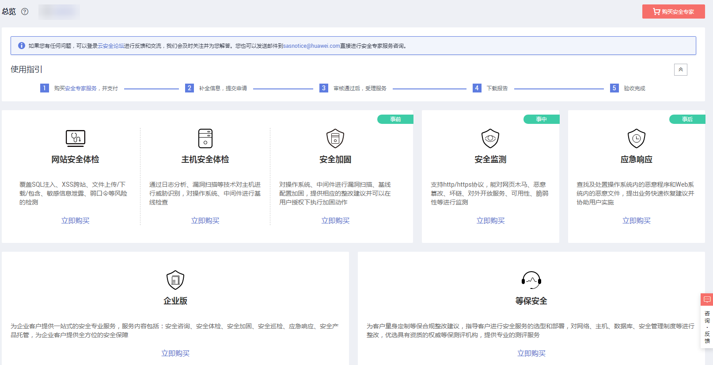

# 查看总览界面

## 操作场景

该任务指导用户查看安全专家服务的服务类型和服务流程。

## 前提条件

已获取管理控制台的登录账号与密码。

## 操作步骤

1.  登录管理控制台。
2.  单击管理控制台页面上方的“服务列表“，选择“安全  \>  安全专家服务“，进入安全专家服务的“总览“界面。
3.  查看安全专家服务的服务类型和使用指引。

    **图 1**  总览  
    

