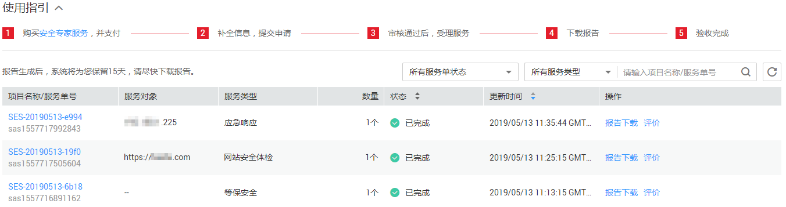
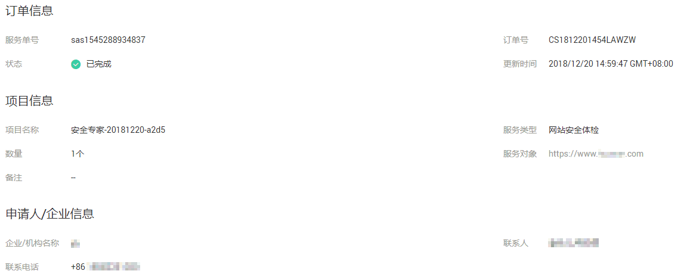

# 查看服务单信息

## 操作场景

该任务指导用户在服务单列表查看服务单信息。

## 前提条件

-   已获取管理控制台的登录账号与密码。
-   用户已购买安全专家服务并成功生成服务单。

## 操作步骤

1.  登录管理控制台。
2.  单击管理控制台页面上方的“服务列表“，选择“安全  \>  安全专家服务“，进入安全专家“总览“界面。
3.  在左侧导航树中，单击“服务列表“，进入安全专家“服务列表“界面。
4.  在服务单列表中，查看服务单信息，如[图1](#fig196539871017)所示，各参数说明如[表1](#table189091416124)所示。

    **图 1**  服务单信息  
    

    > **说明：**   
    >-   在“所有服务单状态“搜索栏选择服务单状态，服务单列表界面将只显示对应状态的服务单。  
    >-   在“所有服务类型“搜索栏选择服务类型，服务单列表界面将只显示对应类型的服务单。  
    >-   在文本框中输入服务单号的关键字或项目名称的关键字，单击或按“Enter“，可以搜索指定的服务单。  

    **表 1**  参数说明

    
    <table><thead align="left"><tr id="row2110687916124"><th class="cellrowborder" valign="top" width="22.869999999999997%" id="mcps1.2.3.1.1">
参数名称

    </th>
    <th class="cellrowborder" valign="top" width="77.13%" id="mcps1.2.3.1.2">
说明

    </th>
    </tr>
    </thead>
    <tbody><tr id="row057915295485"><td class="cellrowborder" valign="top" width="22.869999999999997%" headers="mcps1.2.3.1.1 ">
项目名称/服务单号

    </td>
    <td class="cellrowborder" valign="top" width="77.13%" headers="mcps1.2.3.1.2 ">
购买后由系统自动生成的项目名称和服务单号。

    </td>
    </tr>
    <tr id="row476937154914"><td class="cellrowborder" valign="top" width="22.869999999999997%" headers="mcps1.2.3.1.1 ">
服务对象

    </td>
    <td class="cellrowborder" valign="top" width="77.13%" headers="mcps1.2.3.1.2 ">
进行安全专家服务的站点信息。

    </td>
    </tr>
    <tr id="row14192757426"><td class="cellrowborder" valign="top" width="22.869999999999997%" headers="mcps1.2.3.1.1 ">
服务类型

    </td>
    <td class="cellrowborder" valign="top" width="77.13%" headers="mcps1.2.3.1.2 ">
购买安全专家服务时选择的服务类型，包括：<ul id="ul11213714197"><li>网站安全体检</li><li>主机安全体检</li><li>安全加固</li><li>安全监测</li><li>应急响应</li><li>企业版</li><li>等保安全</li></ul>
    

    </td>
    </tr>
    <tr id="row16209143264211"><td class="cellrowborder" valign="top" width="22.869999999999997%" headers="mcps1.2.3.1.1 ">
数量

    </td>
    <td class="cellrowborder" valign="top" width="77.13%" headers="mcps1.2.3.1.2 ">
购买安全专家服务时设置的数量。

    </td>
    </tr>
    <tr id="row4903510916124"><td class="cellrowborder" valign="top" width="22.869999999999997%" headers="mcps1.2.3.1.1 ">
状态

    </td>
    <td class="cellrowborder" valign="top" width="77.13%" headers="mcps1.2.3.1.2 ">
服务单状态包括：<ul id="ul8278133632418"><li>服务受理中<ul id="ul20557131674213"><li>用户购买企业版安全专家服务或等保安全，服务单付款成功，服务单状态为“服务受理中”。</li><li>用户购买标准版安全专家服务，补全服务单信息且审核通过后，服务单状态更新为“服务受理中”。</li></ul>
    </li><li>已完成
安全专家报告由华为安全专家审核通过后，系统将服务单状态更新为“已完成”。

    </li><li>待审核
用户购买标准版安全专家服务，补全服务单信息后，服务单状态更新为“待审核”。

    </li><li>待补全信息
用户购买标准版安全专家服务，服务单付款成功，服务单状态为“待补全信息”。

    </li></ul>
    

    </td>
    </tr>
    <tr id="row29932933204745"><td class="cellrowborder" valign="top" width="22.869999999999997%" headers="mcps1.2.3.1.1 ">
更新时间

    </td>
    <td class="cellrowborder" valign="top" width="77.13%" headers="mcps1.2.3.1.2 ">
服务单最近一次更新的时间。

    </td>
    </tr>
    <tr id="row41889549161618"><td class="cellrowborder" valign="top" width="22.869999999999997%" headers="mcps1.2.3.1.1 ">
操作

    </td>
    <td class="cellrowborder" valign="top" width="77.13%" headers="mcps1.2.3.1.2 "><ul id="ul4129986216176"><li>补全信息
当服务单状态为“待补全信息”时，用户可以添加站点或主机信息。

    </li><li>报告下载
安全专家服务完成后，系统自动生成安全专家服务报告，并将报告保留15天，用户可以在此期间下载并查看安全专家服务报告。如果超出该时间范围，用户需要获取安全专家服务报告，请联系客服处理。

    </li><li>验收完成
安全专家服务完成后，用户会收到短信通知信息。用户可在收到短信通知起的10日内，对本次安全专家服务进行验收。如果超出该时间范围，则默认安全专家服务验收完成。

    </li><li>评价
安全专家服务完成后，用户会收到短信通知信息。用户可在收到短信通知起的15日内，对本次安全专家服务进行评价，并反馈建议或意见。

    </li></ul>
    </td>
    </tr>
    </tbody>
    </table>

5.  单击项目名称，可以查看服务单的详细信息，如[图2](#fig1198075993315)所示。

    **图 2**  查看服务单详细信息  
    

