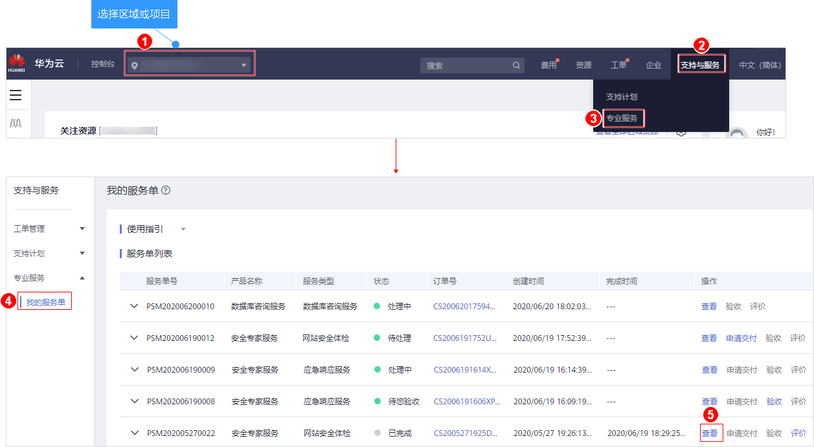

# 查看服务单信息

## 操作场景

该任务指导用户在服务单列表查看服务单信息。

## 前提条件

用户已购买安全专家服务并成功生成服务单。

## 操作步骤

1.  [登录管理控制台](https://console.huaweicloud.com)。
2.  进入查看服务单信息入口，如[图1](#zh-cn_topic_0120428366_fig17532142516127)所示。

    **图 1**  进入查看服务单信息入口  
    

3.  详情页面包含以下内容：
    -   基础信息：服务单的产品信息、联系人信息、服务内容等。

        您可以单击，修改联系人电话和邮箱。

    -   服务单完成信息：服务总结、服务报告。

        等保安全的测评报告请查看：[如何获取等保测评报告](https://support.huaweicloud.com/ses_faq/ses_01_0069.html)。

    -   服务评价：方案完善度、实施专业性、响应及时性。
    -   处理日志：服务单的历史处理进展。

        对于服务单的过程交付件，您可以单击“下载“来获取。

        > **说明：**   
        >“服务单完成信息“和“服务评价“区域在安全专家服务完成后，用户进行验收时呈现。  

