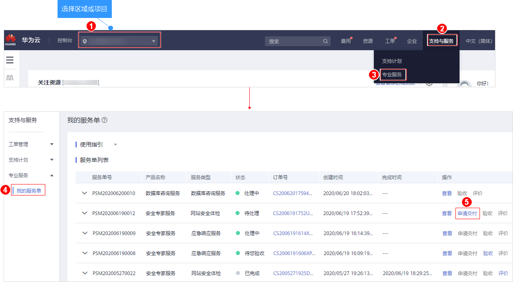
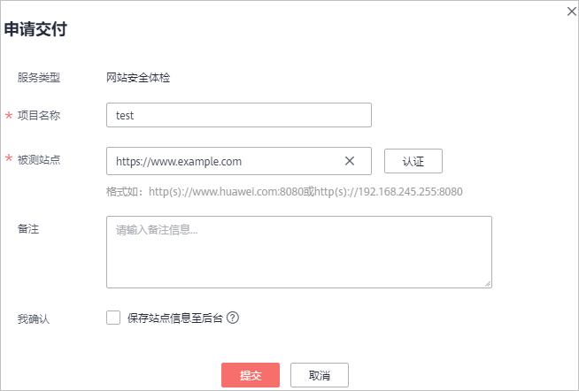
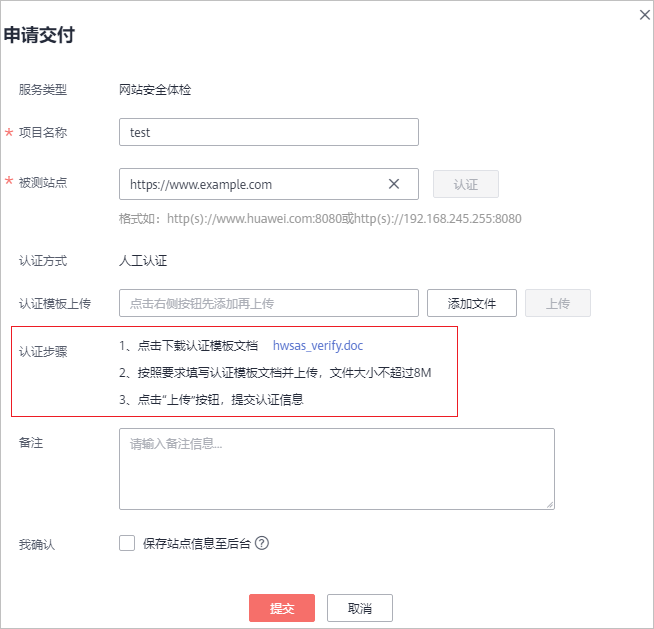

# 申请交付标准版安全专家服务

## 操作场景

用户在成功购买标准版安全专家服务后的1年内，可以根据需要补全信息申请交付。

本章节以补全网站安全体检服务单信息为例，介绍申请交付服务单信息的操作。

> **说明：**   
>申请交付服务单信息流程仅安全专家服务的标准版需要，企业版和等保安全无此项流程。  

## 前提条件

安全专家服务购买成功，且服务单的状态为“待处理“。

## 操作步骤

1.  [登录管理控制台](https://console.huaweicloud.com/?locale=zh-cn)。
2.  进入申请交付服务单信息入口，如[图1](#fig17532142516127)所示。

    **图 1**  进入申请交付服务单信息入口  
    

3.  在弹出的“申请交付“页面，添加“项目名称“、“被测站点“信息，如[图2](#fig667810411844)所示，各参数说明如[表1](#table15289430182714)所示。

    **图 2**  申请交付  
    

    **表 1**  申请交付参数说明

    
    <table><thead align="left"><tr id="row1029223020277"><th class="cellrowborder" valign="top" width="19.470000000000002%" id="mcps1.2.4.1.1">
参数

    </th>
    <th class="cellrowborder" valign="top" width="54.11%" id="mcps1.2.4.1.2">
说明

    </th>
    <th class="cellrowborder" valign="top" width="26.419999999999998%" id="mcps1.2.4.1.3">
配置样例

    </th>
    </tr>
    </thead>
    <tbody><tr id="row18614125415518"><td class="cellrowborder" valign="top" width="19.470000000000002%" headers="mcps1.2.4.1.1 ">
服务类型

    </td>
    <td class="cellrowborder" valign="top" width="54.11%" headers="mcps1.2.4.1.2 ">
购买安全专家服务的类型。

    </td>
    <td class="cellrowborder" valign="top" width="26.419999999999998%" headers="mcps1.2.4.1.3 ">
网站安全体检

    </td>
    </tr>
    <tr id="row17299133052716"><td class="cellrowborder" valign="top" width="19.470000000000002%" headers="mcps1.2.4.1.1 ">
项目名称

    </td>
    <td class="cellrowborder" valign="top" width="54.11%" headers="mcps1.2.4.1.2 ">
自定义项目名称。<ul id="ul1130319300275"><li>名称长度为1～32个字符。</li><li>名称只能由中文字符、大小写英文字母、数字、下划线和中划线组成。</li></ul>
    

    </td>
    <td class="cellrowborder" valign="top" width="26.419999999999998%" headers="mcps1.2.4.1.3 ">
test

    </td>
    </tr>
    <tr id="row183116304273"><td class="cellrowborder" valign="top" width="19.470000000000002%" headers="mcps1.2.4.1.1 ">
被测站点

    </td>
    <td class="cellrowborder" valign="top" width="54.11%" headers="mcps1.2.4.1.2 ">
输入需要进行安全专家服务的站点。

    </td>
    <td class="cellrowborder" valign="top" width="26.419999999999998%" headers="mcps1.2.4.1.3 ">
http(s)://www.example.com

    </td>
    </tr>
    <tr id="row1131611303279"><td class="cellrowborder" valign="top" width="19.470000000000002%" headers="mcps1.2.4.1.1 ">
备注

    </td>
    <td class="cellrowborder" valign="top" width="54.11%" headers="mcps1.2.4.1.2 ">
需要对服务单添加的备注信息。

    </td>
    <td class="cellrowborder" valign="top" width="26.419999999999998%" headers="mcps1.2.4.1.3 ">
-

    </td>
    </tr>
    <tr id="row8276174610305"><td class="cellrowborder" valign="top" width="19.470000000000002%" headers="mcps1.2.4.1.1 ">
我确认

    </td>
    <td class="cellrowborder" valign="top" width="54.11%" headers="mcps1.2.4.1.2 ">
可选，是否保存站点信息至后台。

    
 说明： 

保存站点信息后，再次选用该站点不用重复认证。在您注销华为云账号时，删除站点信息。

    

    </td>
    <td class="cellrowborder" valign="top" width="26.419999999999998%" headers="mcps1.2.4.1.3 ">
-

    </td>
    </tr>
    </tbody>
    </table>

4.  在被测站点所在行的右侧，单击“认证“，认证站点的归属权。
5.  请按照认证步骤，完成资料上传，上传成功后，单击“提交“。

    站点认证成功后，华为安全专家将对被测的站点提供一对一的认证服务。

    **图 3**  站点认证  
    

    > **说明：**   
    >-   当申请交付服务单信息后，华为安全专家将在1个工作日内联系用户，与用户沟通确定测试内容并审核用户的资质。审核通过后，系统线下将订单发送给权威第三方机构，权威第三方机构根据用户订单中描述的站点进行安全专家服务。安全专家服务完成，权威第三方机构将生成的体检报告交由华为安全专家团队审核，审核通过后本次安全专家服务完成。  
    >-   查看服务单后续进度，详细操作，请查看：[查看服务单信息](https://support.huaweicloud.com/usermanual-ses/ses_01_0021.html)。  

