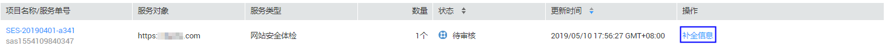
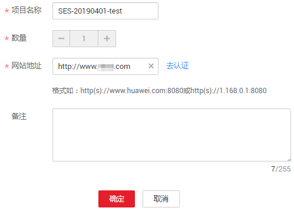
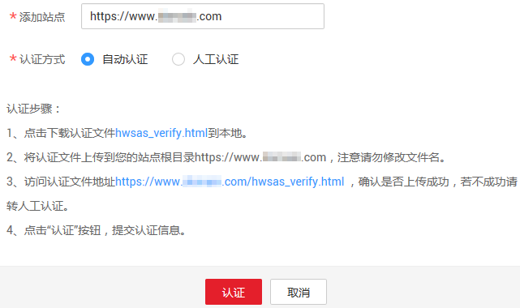
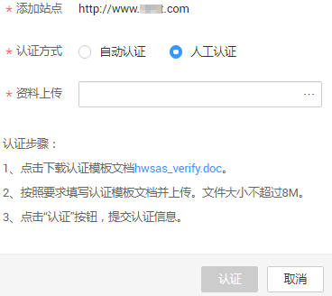

# 补全标准版服务单信息

## 操作场景

用户在成功购买标准版安全专家服务后的1年内，可以根据需要补全服务单信息。

本章节以补全网站安全体检服务单信息为例，介绍补全服务单信息的操作。

在服务单有效期内，用户可以多次补全该服务单的信息。

## 前提条件

-   已获取管理控制台的登录账号与密码。
-   服务单的状态为“待补全信息“。

## 操作步骤

1.  登录管理控制台。
2.  单击页面上方的“服务列表“，选择“安全  \>  安全专家服务  \>  服务列表“，进入安全专家服务列表界面。
3.  在需要补全信息的服务单所在行，单击“补全信息“，如[图1](#fig43913344011)所示。

    **图 1**  补全信息  
    

4.  在弹出的“补全信息“页面，添加站点信息，如[图2](#fig182843301274)所示，各参数说明如[表1](#table15289430182714)所示。

    **图 2** “补全信息“页面  
    

    **表 1**  服务单参数说明

    
    <table><thead align="left"><tr id="row1029223020277"><th class="cellrowborder" valign="top" width="19.470000000000002%" id="mcps1.2.4.1.1">
参数

    </th>
    <th class="cellrowborder" valign="top" width="54.11%" id="mcps1.2.4.1.2">
说明

    </th>
    <th class="cellrowborder" valign="top" width="26.419999999999998%" id="mcps1.2.4.1.3">
配置样例

    </th>
    </tr>
    </thead>
    <tbody><tr id="row17299133052716"><td class="cellrowborder" valign="top" width="19.470000000000002%" headers="mcps1.2.4.1.1 ">
项目名称

    </td>
    <td class="cellrowborder" valign="top" width="54.11%" headers="mcps1.2.4.1.2 ">
自定义项目名称。<ul id="ul1130319300275"><li>名称长度为1～32个字符。</li><li>名称只能由中文字符、大小写英文字母、数字、下划线和中划线组成。</li></ul>
    

    </td>
    <td class="cellrowborder" valign="top" width="26.419999999999998%" headers="mcps1.2.4.1.3 ">
test

    </td>
    </tr>
    <tr id="row11306130122715"><td class="cellrowborder" valign="top" width="19.470000000000002%" headers="mcps1.2.4.1.1 ">
数量

    </td>
    <td class="cellrowborder" valign="top" width="54.11%" headers="mcps1.2.4.1.2 ">
设置需要进行安全专家服务的站点个数，该参数不能修改。

    </td>
    <td class="cellrowborder" valign="top" width="26.419999999999998%" headers="mcps1.2.4.1.3 ">
1

    </td>
    </tr>
    <tr id="row183116304273"><td class="cellrowborder" valign="top" width="19.470000000000002%" headers="mcps1.2.4.1.1 ">
网站地址

    </td>
    <td class="cellrowborder" valign="top" width="54.11%" headers="mcps1.2.4.1.2 ">
输入需要进行安全专家服务的站点和端口。

    </td>
    <td class="cellrowborder" valign="top" width="26.419999999999998%" headers="mcps1.2.4.1.3 ">
http://192.168.1.1:80或http://www.domain.com

    </td>
    </tr>
    <tr id="row1131611303279"><td class="cellrowborder" valign="top" width="19.470000000000002%" headers="mcps1.2.4.1.1 ">
备注

    </td>
    <td class="cellrowborder" valign="top" width="54.11%" headers="mcps1.2.4.1.2 ">
需要对服务单添加的备注信息。

    </td>
    <td class="cellrowborder" valign="top" width="26.419999999999998%" headers="mcps1.2.4.1.3 ">
-

    </td>
    </tr>
    </tbody>
    </table>

5.  在网站地址所在行的右侧，单击“去认证“，在弹出的“认证站点“对话框中，认证站点的归属权。

    > **注意：**   
    >为了避免被测站点因不能通过认证，而影响安全专家服务交付进展，请选择“自动认证“或“人工认证“方式，对被测站点进行认证。  

    -   选择“自动认证“方式

        请用户参照自动认证的操作步骤，对被测的站点进行认证。

        **图 3**  自动认证  
        

    -   选择“人工认证“方式

        请用户参照人工认证的操作步骤，将填写完成的认证表格上传成功后，单击“认证“。华为安全专家将对被测的站点提供一对一的认证服务。

        **图 4**  人工认证  
        

    > **说明：**   
    >当站点正在认证中，认证状态为；当站点认证成功，认证状态为。  

6.  单击“确定“。

    当服务单信息补全后，华为安全专家将在1个工作日内联系用户，与用户沟通确定测试内容并审核用户的资质。审核通过后，系统将服务单的状态更新为“服务受理中“。系统线下将订单发送给权威第三方机构，权威第三方机构根据用户订单中描述的站点进行安全专家服务。安全专家服务完成，权威第三方机构将生成的体检报告交由华为安全专家团队审核，审核通过后本次安全专家服务完成。

