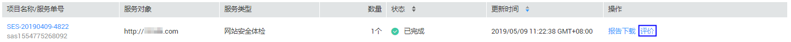
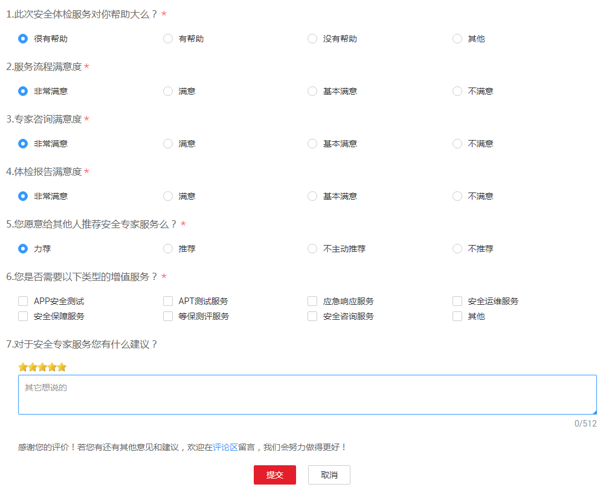

# 评价安全专家服务

## 操作场景

安全专家服务完成后，用户会收到短信通知信息。用户可在收到短信通知起的15日内，对本次安全专家服务进行评价，并反馈建议或意见。

## 前提条件

-   已获取管理控制台的登录账号与密码。
-   安全专家服务完成，且服务单的状态为“已完成“。

## 操作步骤

1.  登录管理控制台。
2.  单击页面上方的“服务列表“，选择“安全  \>  安全专家服务  \>  服务列表“，进入安全专家服务列表界面。
3.  在需要评价的安全专家服务报告的服务单所在行，单击“评价“，进入服务评价界面，如[图1](#fig198492345198)所示。

    **图 1**  评价安全专家服务  
    

4.  对本次安全专家服务进行评价以及反馈意见或建议后，单击“提交“，如[图2](#fig191925257206)所示。

    > **注意：**   
    >用户提交评价意见后，该服务单的服务评价功能失效，用户不能再次提交评价意见。  

    **图 2**  提交评价意见  
    

