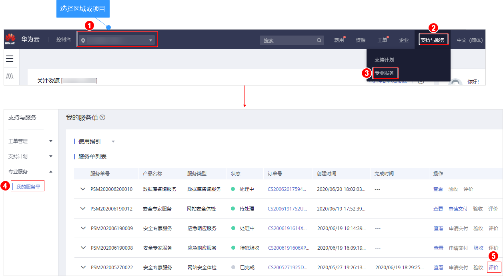

# 评价安全专家服务

## 操作场景

安全专家服务完成后，用户会收到短信通知信息。用户可在收到短信通知后，对本次安全专家服务进行评价，并反馈建议或意见。

## 前提条件

-   安全专家服务完成且服务单状态为“已完成“。
-   验收完成安全专家服务。

## 操作步骤

1.  [登录管理控制台](https://console.huaweicloud.com/?locale=zh-cn)。
2.  进入评价安全专家服务入口，如[图1](#zh-cn_topic_0120428366_fig17532142516127)所示。

    **图 1**  进入评价安全专家服务入口  
    

3.  在“服务评价“区域对本次安全专家服务进行维度评价。

    服务维度包括：方案完善度、实施专业性、响应及时性。

