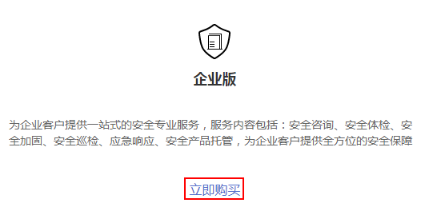
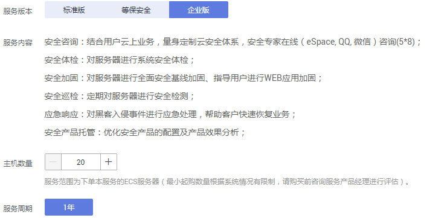
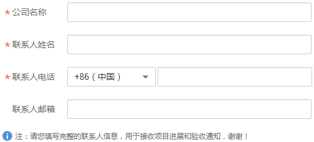

# 购买企业版

企业版的安全专家服务提供一站式的安全专业服务，服务内容包括：安全咨询、安全体检、安全加固、安全巡检、应急响应和安全产品托管。

在购买时，用户需要反馈购买的主机个数（ECS服务器数量）和用户信息。在成功购买服务后，华为安全专家团队将为客户提供安全咨询、安全体检、安全加固、安全巡检、应急响应和安全产品托管一站式的安全专业服务。

> **说明：**   
>您也可以在[安全专家服务](https://www.huaweicloud.com/product/ses.html)官网页面，单击“立即购买“，购买安全专家服务。  

## 前提条件

> **须知：**   
>请确认购买实例的账号具有“SES Administrator“和“BSS Administrator“策略。  
>-   BSS Administrator：对账号中心、费用中心、资源中心中的所有菜单项执行任意操作。项目级策略，在同项目中勾选。  

## 立即购买

1.  [登录管理控制台](https://console.huaweicloud.com)。
2.  单击管理控制台页面上方的“服务列表“，选择“安全  \>  安全专家服务“，进入安全专家服务的“总览“界面。
3.  在“企业版“下方，单击“立即购买“，进入“购买安全专家服务“界面。

    **图 1**  选择企业版  
    

4.  在“服务版本“栏，选择“企业版“后，设置购买的主机数量，如[图2](#zh-cn_topic_0115570353_fig462214533513)所示。

    **图 2**  购买企业版  
    

5.  输入“公司名称“、“联系人姓名“、“联系人电话“和“联系人邮箱“，如[图3](#zh-cn_topic_0115570353_zh-cn_topic_0115570352_fig649782212585)所示。

    **图 3**  设置用户信息（企业版）  
    

6.  在页面右下方，单击“下一步“。
7.  确认订单无误并阅读《安全专家服务免责声明》和《隐私政策声明》后，勾选“我已阅读并同意《安全专家服务免责声明》和《隐私政策声明》“，单击“去支付“。
8.  在“支付“页面，请选择付款方式进行付款。
9.  付款成功后，单击“返回安全专家服务控制台“，返回到“我的服务单“界面。

## 后续管理

购买成功后，服务单列表中会新增一条状态为“处理中“的服务单，表示服务单创建成功。此时，华为安全专家团队将为客户提供安全咨询、安全体检、安全加固、安全巡检、应急响应和安全产品托管一站式的安全专业服务。

> **说明：**   
>-   安全专家服务完成后，系统自动生成安全专家服务报告，用户会收到邮件和短信通知信息。用户可在收到通知信息后下载安全专家服务报告。  

## 相关链接

-   下载安全专家服务报告的详细操作，请查看：[下载安全专家服务报告](下载安全专家服务报告.md)。
-   查看服务单进度的详细操作，请查看：[查看服务单信息](查看服务单信息.md)。
-   如何退订安全专家服务的详细操作，请查看：[安全专家服务是否支持退款](https://support.huaweicloud.com/ses_faq/ses_01_0047.html)。

