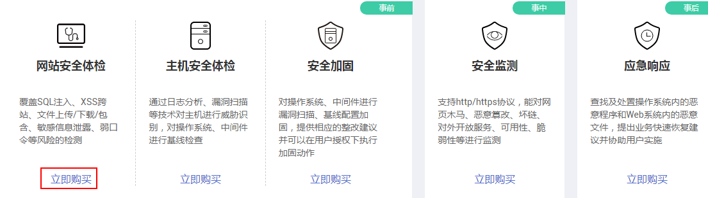
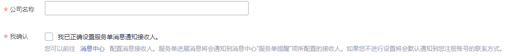

# 购买标准版

标准版的安全专家服务提供网站安全体检、主机安全体检、安全加固、安全监测和应急响应5种服务类型。用户可以根据实际的使用情况，选择相应的服务类型。

在购买时，用户只需要反馈购买的站点个数和用户信息，在成功购买服务后的1年内，再根据需要补全服务单的站点信息。当服务单审核通过后，第三方信息安全测评机构将根据订单中描述的站点进行安全服务。

本章以购买网站安全体检服务为例，介绍购买标准版的操作。

> **说明：**   
>您也可以在[安全专家服务](https://www.huaweicloud.com/product/ses.html)官网页面，单击“立即购买“，购买安全专家服务。  

## 前提条件

> **须知：**   
>请确认购买实例的账号具有“SES Administrator“和“BSS Administrator“策略。  
>-   BSS Administrator：对账号中心、费用中心、资源中心中的所有菜单项执行任意操作。项目级策略，在同项目中勾选。  

## 立即购买

1.  [登录管理控制台](https://console.huaweicloud.com)。
2.  单击管理控制台页面上方的“服务列表“，选择“安全  \>  安全专家服务“，进入安全专家服务的“总览“界面。
3.  在“总览“界面中的“网站安全体检“下方，单击“立即购买“，进入“购买安全专家服务“界面。

    **图 1**  选择网站安全体检  
    

4.  在“服务版本“栏，选择“标准版“后，在“服务类型“栏，选择“网站安全体检“，如[图2](#zh-cn_topic_0115570352_fig462214533513)所示，标准版各服务类型的相关说明如[表1](#zh-cn_topic_0115570352_table544864683318)所示。

    **图 2**  购买网站安全体检  
    

    **表 1**  标准版服务类型说明

    
    <table><thead align="left"><tr id="zh-cn_topic_0115570352_row114461646133318"><th class="cellrowborder" valign="top" width="19%" id="mcps1.2.4.1.1">
服务类型

    </th>
    <th class="cellrowborder" valign="top" width="48%" id="mcps1.2.4.1.2">
服务内容

    </th>
    <th class="cellrowborder" valign="top" width="33%" id="mcps1.2.4.1.3">
说明

    </th>
    </tr>
    </thead>
    <tbody><tr id="zh-cn_topic_0115570352_row17446446203319"><td class="cellrowborder" valign="top" width="19%" headers="mcps1.2.4.1.1 ">
网站安全体检

    </td>
    <td class="cellrowborder" valign="top" width="48%" headers="mcps1.2.4.1.2 ">
覆盖SQL注入、XSS跨站、文件上传、文件下载、文件包含、敏感信息泄露、弱口令等风险的检测。

    </td>
    <td class="cellrowborder" valign="top" width="33%" headers="mcps1.2.4.1.3 ">
提供专业的网站安全评估报告

    </td>
    </tr>
    <tr id="zh-cn_topic_0115570352_row24486468334"><td class="cellrowborder" valign="top" width="19%" headers="mcps1.2.4.1.1 ">
主机安全体检

    </td>
    <td class="cellrowborder" valign="top" width="48%" headers="mcps1.2.4.1.2 "><ul id="zh-cn_topic_0115570352_ul15609159191013"><li>通过日志分析、漏洞扫描等技术手段对主机进行威胁识别。</li><li>通过基线检查发现主机操作系统、中间件存在的错误配置、不符合项和弱口令等风险。</li></ul>
    </td>
    <td class="cellrowborder" valign="top" width="33%" headers="mcps1.2.4.1.3 ">
提供专业的主机安全评估报告

    </td>
    </tr>
    <tr id="zh-cn_topic_0115570352_row6448124693311"><td class="cellrowborder" valign="top" width="19%" headers="mcps1.2.4.1.1 ">
安全加固

    </td>
    <td class="cellrowborder" valign="top" width="48%" headers="mcps1.2.4.1.2 "><ul id="zh-cn_topic_0115570352_ul8846201017111"><li>对主机服务器、中间件进行漏洞扫描、基线配置加固。</li><li>分析操作系统及应用面临的安全威胁，分析操作系统补丁和应用系统组件版本。</li><li>提供相应的整改建议，并在用户的许可下完成相关漏洞的修复和补丁组件的加固工作。</li></ul>
    </td>
    <td class="cellrowborder" valign="top" width="33%" headers="mcps1.2.4.1.3 ">
提供专业的安全加固报告

    </td>
    </tr>
    <tr id="zh-cn_topic_0115570352_row1448546133313"><td class="cellrowborder" valign="top" width="19%" headers="mcps1.2.4.1.1 ">
安全监测

    </td>
    <td class="cellrowborder" valign="top" width="48%" headers="mcps1.2.4.1.2 "><ul id="zh-cn_topic_0115570352_ul134254481616"><li>提供7*24小时安全监测，发现安全问题实时通过电话、邮件等形式进行告警。</li><li>支持HTTP/HTTPS协议进行实时安全监测。</li><li>支持网页木马、恶意篡改、坏链、对外开放服务、可用性、脆弱性等六个维度对网站进行监测。</li><li>支持Web安全漏洞扫描及域名劫持进行实时安全监测。</li><li>定期推送网站安全体检报告，让用户全面了解网站的运行情况。</li></ul>
    </td>
    <td class="cellrowborder" valign="top" width="33%" headers="mcps1.2.4.1.3 "><ul id="zh-cn_topic_0115570352_ul55717433714"><li>安全问题实时预警</li><li>提供四份季度报告，一份年度报告，发生风险时的通知预警，一年有效</li></ul>
    </td>
    </tr>
    <tr id="zh-cn_topic_0115570352_row0733134212219"><td class="cellrowborder" valign="top" width="19%" headers="mcps1.2.4.1.1 ">
应急响应

    </td>
    <td class="cellrowborder" valign="top" width="48%" headers="mcps1.2.4.1.2 "><ul id="zh-cn_topic_0115570352_ul2017905918813"><li>通过远程查找及时处置主机系统内的恶意程序，包括病毒、木马、蠕虫等。</li><li>通过远程查找及时处置Web系统内的可疑文件，包括Webshell、黑客工具和暗链等。</li><li>提出业务快速恢复建议，协助用户快速恢复业务。</li></ul>
    </td>
    <td class="cellrowborder" valign="top" width="33%" headers="mcps1.2.4.1.3 ">
提供专业的安全应急处置报告

    </td>
    </tr>
    </tbody>
    </table>

5.  设置购买的站点数量。
6.  输入“公司名称“、“联系人姓名“、“联系人电话“和“联系人邮箱“，如[图3](#zh-cn_topic_0115570352_fig12371754124619)所示。

    **图 3**  设置用户信息  
    

7.  在页面右下方，单击“下一步“。
8.  确认订单无误并阅读《安全专家服务免责声明》和《隐私政策声明》后，勾选“我已阅读并同意《安全专家服务免责声明》和《隐私政策声明》“，单击“去支付“。
9.  在“支付“页面，请选择付款方式进行付款。
10. 付款成功后，单击“返回安全专家服务控制台“，返回到“我的服务单“界面。

## 后续管理

购买完成后，服务单列表中会新增一条状态为“待处理“的服务单，表示服务单创建成功。用户在接收到华为云已受理短信后，服务单状态为“处理中“。此时，用户可在服务单操作列单击“申请交付“，补全服务单信息。补全服务单信息的详细操作，请参见[补全标准版服务单信息](https://support.huaweicloud.com/usermanual-ses/ses_01_0049.html)。

当服务单信息补全后，华为安全专家将在1个工作日内联系用户，与用户沟通确定测试内容并审核用户的资质。审核通过后，系统线下将订单发送给权威第三方机构，权威第三方机构根据用户订单中描述的站点进行安全专家服务。安全专家服务完成，权威第三方机构将生成的体检报告交由华为安全专家团队审核，审核通过后本次安全专家服务完成。

> **说明：**   
>-   安全专家服务完成后，系统自动生成安全专家服务报告，用户会收到邮件和短信通知信息。用户可在收到通知信息后下载安全专家服务报告。  

## 相关链接

有关安全专家服务查看服务单进度、下载报告、退订的详细介绍，请参见：

1.  [查看服务单信息](查看服务单信息.md)。
2.  [下载安全专家服务报告](下载安全专家服务报告.md)。
3.  [安全专家服务是否支持退款](https://support.huaweicloud.com/ses_faq/ses_01_0047.html)。

