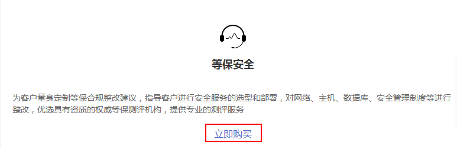
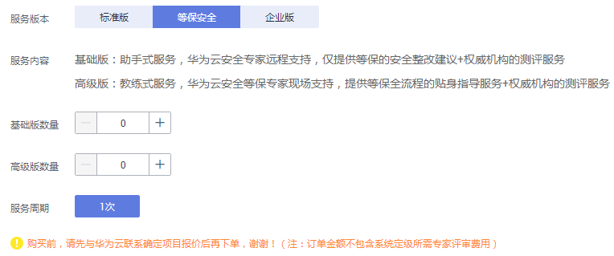

# 购买等保安全

等保安全为客户量身定制等保合规整改建议，指导客户进行安全服务的选型和部署，对网络、主机、数据库、安全管理制度等进行整改，优选具有资质的权威等保测评机构，提供专业的测评服务。

在购买时，用户需要反馈基础版和高级版的数量，以及用户信息。在成功购买服务后，华为安全专家团队将为客户量身定制等保合规整改建议，指导客户进行安全服务的选型和部署，对网络、主机、数据库、安全管理制度等进行整改，优选具有资质的权威等保测评机构，提供专业的测评服务。

> **说明：**   
>-   您也可以在[安全专家服务](https://www.huaweicloud.com/product/ses.html)官网页面，单击“立即购买“，购买安全专家服务。  
>-   购买前，请先与华为云联系确定项目报价后再下单。  

## 前提条件

> **须知：**   
>请确认购买实例的账号具有“SES Administrator“和“BSS Administrator“策略。  
>-   BSS Administrator：对账号中心、费用中心、资源中心中的所有菜单项执行任意操作。项目级策略，在同项目中勾选。  

## 立即购买

1.  [登录管理控制台](https://console.huaweicloud.com)。
2.  单击管理控制台页面上方的“服务列表“，选择“安全  \>  安全专家服务“，进入安全专家服务的“总览“界面。
3.  在“等保安全“下方，单击“立即购买“，进入“购买安全专家服务“界面。

    **图 1**  选择等保安全  
    

4.  在“服务版本“栏，选择“等保安全“后，设置“基础版“和“高级版“的购买数量，如[图2](#zh-cn_topic_0115570354_fig462214533513)所示。

    **图 2**  购买等保安全  
    

5.  设置用户相关信息，如[图3](#zh-cn_topic_0115570354_fig1749620362443)所示，各参数说明如[表1](#zh-cn_topic_0115570354_table1915312284575)所示。

    **图 3**  设置用户信息（等保安全）  
    

    **表 1**  用户信息参数说明

    
    <table><thead align="left"><tr id="zh-cn_topic_0115570354_row12160142855710"><th class="cellrowborder" valign="top" width="19.470000000000002%" id="mcps1.2.4.1.1">
参数

    </th>
    <th class="cellrowborder" valign="top" width="54.11%" id="mcps1.2.4.1.2">
说明

    </th>
    <th class="cellrowborder" valign="top" width="26.419999999999998%" id="mcps1.2.4.1.3">
配置样例

    </th>
    </tr>
    </thead>
    <tbody><tr id="zh-cn_topic_0115570354_row87301857151416"><td class="cellrowborder" valign="top" width="19.470000000000002%" headers="mcps1.2.4.1.1 ">
公司名称

    </td>
    <td class="cellrowborder" valign="top" width="54.11%" headers="mcps1.2.4.1.2 ">
输入公司的名称。

    </td>
    <td class="cellrowborder" valign="top" width="26.419999999999998%" headers="mcps1.2.4.1.3 ">
-

    </td>
    </tr>
    <tr id="zh-cn_topic_0115570354_row153818311151"><td class="cellrowborder" valign="top" width="19.470000000000002%" headers="mcps1.2.4.1.1 ">
机构所在省市

    </td>
    <td class="cellrowborder" valign="top" width="54.11%" headers="mcps1.2.4.1.2 ">
选择公司所在的省市。

    </td>
    <td class="cellrowborder" valign="top" width="26.419999999999998%" headers="mcps1.2.4.1.3 ">
北京市

    </td>
    </tr>
    <tr id="zh-cn_topic_0115570354_row66311448171517"><td class="cellrowborder" valign="top" width="19.470000000000002%" headers="mcps1.2.4.1.1 ">
行业属性

    </td>
    <td class="cellrowborder" valign="top" width="54.11%" headers="mcps1.2.4.1.2 ">
选择行业的类型。

    </td>
    <td class="cellrowborder" valign="top" width="26.419999999999998%" headers="mcps1.2.4.1.3 ">
银行

    </td>
    </tr>
    <tr id="zh-cn_topic_0115570354_row18439204191613"><td class="cellrowborder" valign="top" width="19.470000000000002%" headers="mcps1.2.4.1.1 ">
联系人姓名

    </td>
    <td class="cellrowborder" valign="top" width="54.11%" headers="mcps1.2.4.1.2 ">
输入真实的联系人姓名。

    </td>
    <td class="cellrowborder" valign="top" width="26.419999999999998%" headers="mcps1.2.4.1.3 ">
-

    </td>
    </tr>
    <tr id="zh-cn_topic_0115570354_row155961137122513"><td class="cellrowborder" valign="top" width="19.470000000000002%" headers="mcps1.2.4.1.1 ">
联系人电话

    </td>
    <td class="cellrowborder" valign="top" width="54.11%" headers="mcps1.2.4.1.2 ">
输入真实的联系人的联系电话。

    </td>
    <td class="cellrowborder" valign="top" width="26.419999999999998%" headers="mcps1.2.4.1.3 ">
-

    </td>
    </tr>
    <tr id="zh-cn_topic_0115570354_row17882145117427"><td class="cellrowborder" valign="top" width="19.470000000000002%" headers="mcps1.2.4.1.1 ">
联系人邮箱

    </td>
    <td class="cellrowborder" valign="top" width="54.11%" headers="mcps1.2.4.1.2 ">
输入真实的联系人的邮箱。

    </td>
    <td class="cellrowborder" valign="top" width="26.419999999999998%" headers="mcps1.2.4.1.3 ">
-

    </td>
    </tr>
    </tbody>
    </table>

6.  在页面右下方，单击“下一步“。
7.  确认订单无误并阅读《安全专家服务免责声明》和《隐私政策声明》后，勾选“我已阅读并同意《安全专家服务免责声明》和《隐私政策声明》“，单击“去支付“。
8.  在“支付“页面，请选择付款方式进行付款。
9.  付款成功后，单击“返回安全专家服务控制台“，返回到“我的服务单“界面。

    购买成功后，华为安全专家将在1个工作日内联系用户，与用户沟通确定等保需求。

    > **须知：**   
    >等保安全仅支持下载整改解决方案和差距分析报告，测评报告将由测评机构直接邮寄给用户。  

## 相关链接

-   [查看服务单信息](查看服务单信息.md)
-   [验收安全专家服务](验收安全专家服务.md)
-   [下载安全专家服务报告](下载安全专家服务报告.md)

