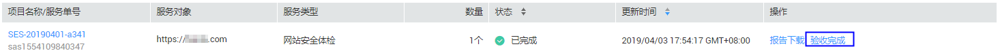

# 验收安全专家服务

## 操作场景

安全专家服务完成后，用户会收到短信通知信息。用户可在收到短信通知起的10日内，对本次安全专家服务进行验收。如果超出该时间范围，则默认安全专家服务验收完成。

## 前提条件

-   已获取管理控制台的登录账号与密码。
-   安全专家服务完成，且服务单的状态为“已完成“。

## 操作步骤

1.  登录管理控制台。
2.  单击管理控制台页面上方的“服务列表“，选择“安全  \>  安全专家服务“，进入安全专家“总览“界面。
3.  在左侧导航树中，单击“服务列表“，进入安全专家“服务列表“界面。
4.  在需要验收的安全专家服务的服务单所在行，单击“验收完成“，如[图1](#fig8586192619172)所示。

    **图 1**  验收安全专家服务  
    

验收完成后，“验收完成“按钮变为“评价“按钮，此时用户可以对本次安全专家服务进行评价。

