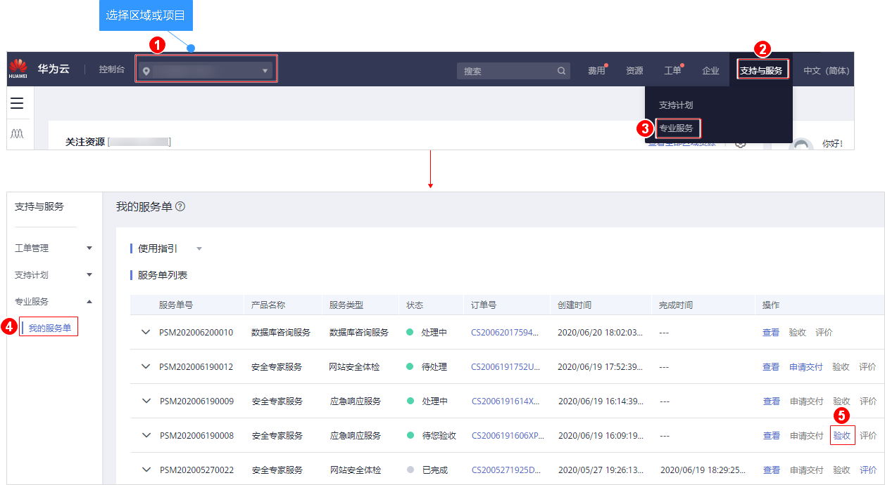

# 验收安全专家服务

## 操作场景

安全专家服务完成后，用户会收到短信通知信息。用户可在收到短信通知起的10日内，对本次安全专家服务进行验收。如果超出该时间范围，系统将对本次安全专家服务进行自动验收。

## 前提条件

安全专家服务完成，且服务单的状态为“待您验收“。

## 操作步骤

1.  [登录管理控制台](https://console.huaweicloud.com)。
2.  进入验收安全专家服务入口，如[图1](#zh-cn_topic_0120428366_fig17532142516127)所示。

    **图 1**  进入验收安全专家服务入口  
    

3.  验收服务单。
    -   如果服务单满足交付要求，请单击“立即验收“。
    -   如果服务单不满足交付要求，请单击“验收延期“，并填写延期原因。

